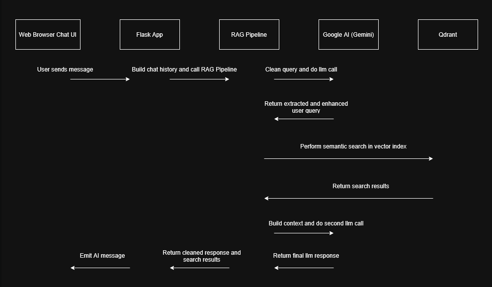

# RAG Chatbot


**AI chatbot powered by Retrieval-Augmented Generation (RAG)**

---

## Table of Contents

- [Overview](#overview)
- [Features](#features)
- [Technology Stack](#technology-stack)
- [Architecture](#architecture)
- [Installation & Setup](#installation--setup)
- [Usage](#usage)
- [Rate Limits & Considerations](#rate-limits--considerations)
- [License](#license)

---

## Overview

The RAG Chatbot is an advanced conversational AI system designed to provide intelligent customer support for any organization's products and services. Built using Retrieval-Augmented Generation (RAG) technology, the chatbot combines the power of Google's Gemini AI with a sophisticated vector database to deliver accurate, contextual responses based on your organization's knowledge base. For demonstration purposes, this project includes a fictional technology company called AuraTech that manufactures phones, laptops, and accessories, but the system can be easily adapted to work with any brand or organization's documents and knowledge base.

### Key Features and Capabilities

- **Context-Aware Responses**: RAG system retrieves relevant information to provide accurate answers
- **Real-Time Communication**: WebSocket-based chat interface for instant responses
- **Session Management**: Persistent conversation history and session tracking
- **Safety & Moderation**: Built-in content filtering and safety mechanisms

---

## Features

### 🗨️ **Real-time Chat Interface**
- WebSocket-powered instant messaging
- Markdown rendering for rich text responses
- Typing indicators and message status

### 🧠 **RAG (Retrieval-Augmented Generation) System**
- Advanced semantic search using vector embeddings
- Context-aware response generation
- Multi-source information synthesis
- Source attribution and transparency

### 🗄️ **Vector Database Integration**
- Qdrant vector database for efficient similarity search
- Semantic document chunking and indexing

### 👤 **Session Management**
- Unique session tracking for each conversation
- Persistent conversation history

### 🛡️ **Safety Filters and Content Moderation**
- Google AI safety filters for input/output content
- Custom input sanitisation and validation

### 📱 **Responsive Web Interface**
- Responsive design for desktop and mobile
- Accessibility features (ARIA labels, keyboard navigation)
- Modern UI with smooth animations

### 💾 **Conversation History Persistence**
- Session data persistence across browser refreshes
- Message logging

---

## Technology Stack

### **Backend**
- **Flask**
- **Flask-SocketIO**

### **AI/LLM**
- **Google AI (Gemini)**
- **Qdrant Vector Database**
- **Sentence Transformers**

### **Database**
- **PostgreSQL**

### **Frontend**
- **HTML**
- **CSS**
- **VJavaScript**

---

## Architecture

### System Architecture



### RAG Pipeline Flow

1. **Input Processing**: User query cleaning and validation
2. **Query Extraction**: LLM-based query refinement for better search
3. **Vector Search**: Semantic similarity search in Qdrant database
4. **Context Building**: Retrieved documents formatted for LLM context
5. **Response Generation**: Google AI generates contextual response
6. **Response Delivery**: Formatted response sent to user

---

## Installation & Setup

### Prerequisites

- **Python 3.8+**
- **Google AI API Key** (for Gemini access)
- **Docker** (for PostgreSQL, Qdrant)

### Environment Setup

1. **Clone the repository**
   ```bash
   git clone https://github.com/oakker-myo/rag-chatbot.git
   cd rag-chatbot
   ```

2. **Create a virtual environment**
   ```bash
   python -m venv venv
   
   # On Windows
   venv\Scripts\activate
   
   # On macOS/Linux
   source venv/bin/activate
   ```

3. **Install required packages**
   ```bash
   pip install -r requirements.txt
   ```

### Configuration Steps

4. **Set up environment variables**
   Create a `.env` file in the root directory:
   ```env
   GOOGLE_AI_API_KEY=your_google_ai_api_key_here
   DB_HOST=localhost
   DB_PORT=5432
   DB_NAME=rag_chatbot
   DB_USER=rag_user
   DB_PASSWORD=rag_password
   DB_MIN_CONNECTIONS=1
   DB_MAX_CONNECTIONS=10
   FLASK_ENV=development
   SECRET_KEY=your-secret-key
   ```

### Docker Setup Instructions 

5. **Download and Install Docker Desktop**

    * Navigate to the official Docker Desktop download page.

    * Locate and click the button to download the `Docker Desktop Installer.exe` file.

    * Find the `Docker Desktop Installer.exe` in your Downloads folder or wherever you saved it.

    * Double-click `Docker Desktop Installer.exe` to start the installation wizard.

    * Proceed through the installation prompts. You will typically be asked to confirm settings and permissions.

    * After your computer has restarted, open a Command Prompt or PowerShell window and run the following commands to verify that Docker Desktop is installed and running correctly:

    ```bash
    docker --version
    ```
---

## Usage

### Starting the Application

1. **Activate virtual environment**
   ```bash
   # Windows
   venv\Scripts\activate
   
   # macOS/Linux
   source venv/bin/activate
   ```
   **Start Docker services in another terminal**
   ```bash
   docker-compose up -d
   ```

2. **Start the Flask application**
   ```bash
   python app.py
   ```

3. **Access the application**
   - Open browser and navigate to `http://localhost:5000`
   - Start chatting with the RAG Chatbot

### Basic Usage Examples

#### **Customer Inquiry**
```
User: "Tell me about AuraTech laptops"
Bot: Provides detailed information about AuraTech laptop lineup with sources
```

#### **Technical Support**
```
User: "My AuraPhone won't charge properly"
Bot: Offers troubleshooting steps and support contact information
```

#### **Inavlid Questions**
```
User: "What's the weather?"
Bot: Refuses to answer and reminds user what it can help with
```

---

### Advanced Usage

Build your own bot by customising its knowledge and personality!

#### 1. Custom Knowledge Base:

Replace or add your own documents to the `documents/` folder. It is recommended to use "---CHUNK_BOUNDARY---" as a delimiter within your documents to improve chunking. See original documents for reference.

#### 2. Modifying System Prompts:

For fine-grained control over the bot's responses and tone, you can directly edit the `promptflow.py` file. Locate and modify the `system prompt` variables to shape the AI's persona and guidelines. Remember to restart the application for changes to take effect.

---

## Rate Limits & Considerations

### Google AI API Limits

- **Free Tier**: Please check the official Google website for latest information - [Rate Limits | Gemini API | Google AI for Developers](https://ai.google.dev/gemini-api/docs/rate-limits)

---

## License

This project is licensed under the MIT License - see the [LICENSE](LICENSE) file for details.

---
